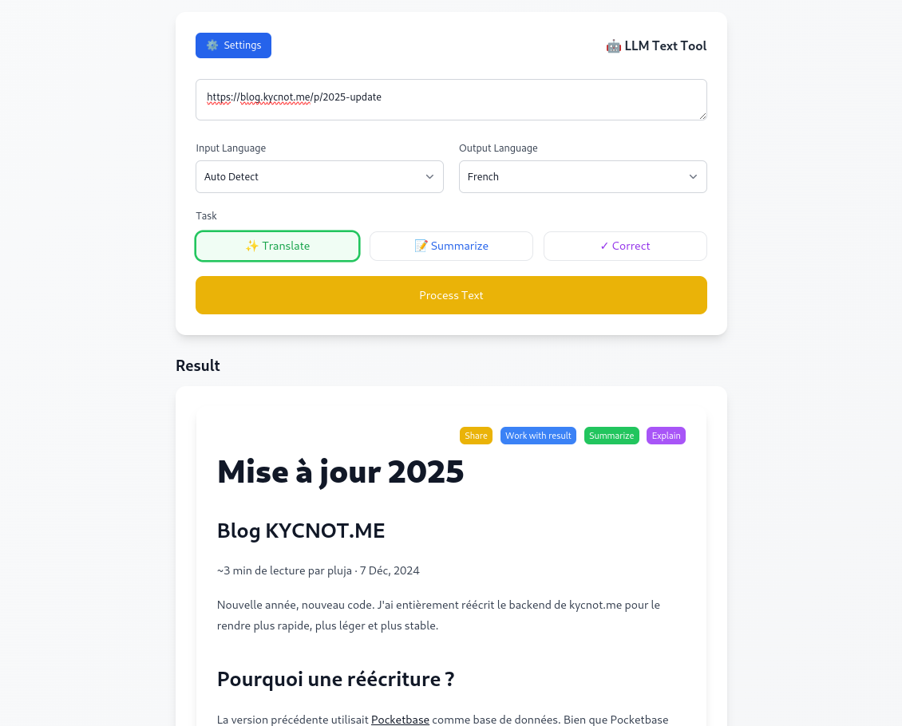

# LLM Language Tool 🌐

A lightweight, browser-based text processing tool powered by Large Language Models (LLMs). Process, translate, and analyze text directly in your browser without any backend or server dependencies.

### [Click here](https://langtool.pluja.dev/#JTIzJTIwTWlzZSUyMCVDMyVBMCUyMGpvdXIlMjAyMDI1JTBBJTBBQmxvZyUyMEtZQ05PVC5NRSUwQS0tLS0tLS0tLS0tLS0tJTBBJTBBfjMlMjBtaW4lMjBkZSUyMGxlY3R1cmUlMjBwYXIlMjBwbHVqYSUyMCVDMiVCNyUyMDclMjBEJUMzJUE5YyUyQyUyMDIwMjQlMEElMEFOb3V2ZWxsZSUyMGFubiVDMyVBOWUlMkMlMjBub3V2ZWF1JTIwY29kZS4lMjBKJ2FpJTIwZW50aSVDMyVBOHJlbWVudCUyMHIlQzMlQTklQzMlQTljcml0JTIwbGUlMjBiYWNrZW5kJTIwZGUlMjBreWNub3QubWUlMjBwb3VyJTIwbGUlMjByZW5kcmUlMjBwbHVzJTIwcmFwaWRlJTJDJTIwcGx1cyUyMGwlQzMlQTlnZXIlMjBldCUyMHBsdXMlMjBzdGFibGUuJTBBJTBBUG91cnF1b2klMjB1bmUlMjByJUMzJUE5JUMzJUE5Y3JpdHVyZSUyMCUzRiUwQS0tLS0tLS0tLS0tLS0tLSUwQSUwQUxhJTIwdmVyc2lvbiUyMHByJUMzJUE5YyVDMyVBOWRlbnRlJTIwdXRpbGlzYWl0JTIwJTVCUG9ja2V0YmFzZSU1RChodHRwcyUzQSUyRiUyRnBvY2tldGJhc2UuaW8lMkYpJTIwY29tbWUlMjBiYXNlJTIwZGUlMjBkb25uJUMzJUE5ZXMuJTIwQmllbiUyMHF1ZSUyMFBvY2tldGJhc2UlMjBuJ2FpdCUyMHBhcyUyMGRlJTIwU0RLJTIwb2ZmaWNpZWwlMjBHb2xhbmclMkMlMjBqJ2FpJTIwJTVCbWFpbnRlbnUlMjB1biUyMGZvcmslMjBwb3VyJTIwa3ljbm90Lm1lJTVEKGh0dHBzJTNBJTJGJTJGZ2l0aHViLmNvbSUyRnBsdWphJTJGcG9ja2V0YmFzZSkuJTIwQmllbiUyMHF1ZSUyMGNlbGElMjBhaXQlMjBmb25jdGlvbm4lQzMlQTklMjBhdSUyMGQlQzMlQTlidXQlMkMlMjBkZXMlMjBwcm9ibCVDMyVBOG1lcyUyMGRlJTIwc3RhYmlsaXQlQzMlQTklMjBvbnQlMjAlQzMlQTltZXJnJUMzJUE5JTIwLSUyMGxlJTIwc2VydmljZSUyMGRvY2tlciUyMHMnYXJyJUMzJUFBdGFpdCUyMG9jY2FzaW9ubmVsbGVtZW50JTJDJTIwZW50cmElQzMlQUVuYW50JTIwbGElMjBjaHV0ZSUyMGRlJTIwdG91dCUyMGxlJTIwc2l0ZSUyMHdlYi4lMjBBcHIlQzMlQThzJTIwZGVzJTIwdGVudGF0aXZlcyUyMGluZnJ1Y3R1ZXVzZXMlMjBkZSUyMGQlQzMlQTlib2dhZ2UlMjBldCUyMGZhY2UlMjAlQzMlQTAlMjBkZXMlMjBjaGFuZ2VtZW50cyUyMGQnQVBJJTIwaW1wb3J0YW50cyUyMGRhbnMlMjBQb2NrZXRiYXNlJTIwdjAuMjMlMjBxdWklMjBuJUMzJUE5Y2Vzc2l0ZXJhaWVudCUyMGRlcyUyMG1pc2VzJTIwJUMzJUEwJTIwam91ciUyMGltcG9ydGFudGVzJTIwZHUlMjBTREslMkMlMjBqJ2FpJTIwZCVDMyVBOWNpZCVDMyVBOSUyMGRlJTIwbWlncmVyJTIwdmVycyUyME1hcmlhREIuJTBBJTBBQXlhbnQlMjBhY3F1aXMlMjBwbHVzJTIwZCdleHAlQzMlQTlyaWVuY2UlMjBhdmVjJTIwR29sYW5nJTIwYXUlMjBmaWwlMjBkZXMlMjBhbnMlMkMlMjBqJ2FpJTIwJUMzJUE5Z2FsZW1lbnQlMjBzYWlzaSUyMGNldHRlJTIwb3Bwb3J0dW5pdCVDMyVBOSUyMHBvdXIlMjBtZXR0cmUlMjAlQzMlQTAlMjBqb3VyJTIwbGUlMjBjb2RlLiUyMEplJTIwc3VpcyUyMHBhc3MlQzMlQTklMjBkZXMlMjBtb2QlQzMlQThsZXMlMjBHbyUyMCVDMyVBMCUyMCU1QlRlbXBsJTVEKGh0dHBzJTNBJTJGJTJGdGVtcGwuZ3VpZGUlMkYpJTIwcG91ciUyMGxlJTIwdGVtcGxhdGluZyUyMGR1JTIwZnJvbnRlbmQlMkMlMjBqJ2FpJTIwcmVzdHJ1Y3R1ciVDMyVBOSUyMGxlJTIwcHJvamV0JTJDJTIwc2ltcGxpZmklQzMlQTklMjBsZSUyMGNvZGUlMjBldCUyMGVmZmVjdHUlQzMlQTklMjB1bmUlMjByZXZ1ZSUyMGNvbXBsJUMzJUE4dGUlMjBkZSUyMGNlbHVpLWNpLiUwQSUwQVF1b2klMjBkZSUyMG5ldWYlMjAlM0YlMEEtLS0tLS0tLS0tLSUwQSUwQUJpZW4lMjBxdWUlMjBsYSUyMHBsdXBhcnQlMjBkZXMlMjBjaGFuZ2VtZW50cyUyMHNvaWVudCUyMGRlcyUyMGFtJUMzJUE5bGlvcmF0aW9ucyUyMGR1JTIwYmFja2VuZCUyQyUyMGxlcyUyMHV0aWxpc2F0ZXVycyUyMGRldnJhaWVudCUyMHJlbWFycXVlciUyMCUzQSUwQSUwQSoqUGVyZm9ybWFuY2UlMjBldCUyMHN0YWJpbGl0JUMzJUE5KiolMEElMEEqJTIwJTIwJTIwQW0lQzMlQTlsaW9yYXRpb24lMjBkZSUyMGxhJTIwc3RhYmlsaXQlQzMlQTklMjBnbG9iYWxlJTBBKiUyMCUyMCUyMFRlbXBzJTIwZGUlMjBjaGFyZ2VtZW50JTIwZGVzJTIwcGFnZXMlMjBwbHVzJTIwcmFwaWRlcyUwQSolMjAlMjAlMjBSJUMzJUE5ZHVjdGlvbiUyMGRlJTIwbGElMjB0YWlsbGUlMjBkZXMlMjBkb25uJUMzJUE5ZXMlMjB0cmFuc21pc2VzJTBBKiUyMCUyMCUyME1laWxsZXVyZSUyMHBlcmZvcm1hbmNlJTIwZGUlMjByZWNoZXJjaGUlMEElMEEqKk5vdXZlbGxlcyUyMGZvbmN0aW9ubmFsaXQlQzMlQTlzJTIwZXQlMjBhbSVDMyVBOWxpb3JhdGlvbnMqKiUwQSUwQSolMjAlMjAlMjBOb3V2ZWxsZSUyMHBhZ2UlMjBkZSUyMHIlQzMlQTlmJUMzJUE5cmVuY2UlMjBkZXMlMjBhdHRyaWJ1dHMlMjAlM0ElMjAlNUJodHRwcyUzQSUyRiUyRmt5Y25vdC5tZSUyRmF0dHJpYnV0ZXMlNUQoaHR0cHMlM0ElMkYlMkZreWNub3QubWUlMkZhdHRyaWJ1dGVzKSUwQSolMjAlMjAlMjBQYWdlJTIwZGUlMjBqb3VybmFsJTIwZGVzJTIwbW9kaWZpY2F0aW9ucyUyMHJlcGVucyVDMyVBOWUlMjAlM0ElMjAlNUJodHRwcyUzQSUyRiUyRmt5Y25vdC5tZSUyRmNoYW5nZWxvZyU1RChodHRwcyUzQSUyRiUyRmt5Y25vdC5tZSUyRmNoYW5nZWxvZyklMEEqJTIwJTIwJTIwUGFnZSUyMGRlcyUyMHNlcnZpY2VzJTIwZW4lMjBhdHRlbnRlJTIwcmVwZW5zJUMzJUE5ZSUyMCUzQSUyMCU1Qmh0dHBzJTNBJTJGJTJGa3ljbm90Lm1lJTJGcGVuZGluZyU1RChodHRwcyUzQSUyRiUyRmt5Y25vdC5tZSUyRnBlbmRpbmcpJTBBJTIwJTIwJTIwJTIwKiUyMCUyMCUyMERlJTIwcGx1cyUyQyUyMGxlcyUyMGxpc3RlcyUyMGVuJTIwYXR0ZW50ZSUyMG9udCUyMG1haW50ZW5hbnQlMjB1biUyMGF2ZXJ0aXNzZW1lbnQlMjBwbHVzJTIwZ3JhbmQlMEEqJTIwJTIwJTIwQW0lQzMlQTlsaW9yYXRpb24lMjBkdSUyMHNjcmFwaW5nJTIwZGVzJTIwQ0dVJTIwcGFyJTIwbCdJQSUyMGV0JTIwZGUlMjBsJ2F1dG9tYXRpc2F0aW9uJTIwZGUlMjBsYSUyMHJldnVlJTBBKiUyMCUyMCUyME5vdXZlbGxlcyUyMG5vdGVzJTIwZGUlMjBzZXJ2aWNlJTIwc3RydWN0dXIlQzMlQTllcyUyMChhdmVydGlzc2VtZW50cyUyQyUyMGluZm9ybWF0aW9ucyUyQyUyMGFsZXJ0ZXMpJTBBKiUyMCUyMCUyMEFsZ29yaXRobWUlMjBkZSUyMHNjb3JlJTIwbWlzJTIwJUMzJUEwJTIwam91ciUwQSolMjAlMjAlMjBWZW50aWxhdGlvbiUyMGR1JTIwc2NvcmUuJTIwSWwlMjBzdWZmaXQlMjBkJ2Fqb3V0ZXIlMjAnJTYwJTJGc3VtbWFyeSU2MCclMjAlQzMlQTAlMjBuJ2ltcG9ydGUlMjBxdWVsbGUlMjBVUkwlMjBkZSUyMHNlcnZpY2UlMEEqJTIwJTIwJTIwSW1hZ2VzJTIwZGUlMjBzZXJ2aWNlJTIwMTI4eDEyOHB4JTIwaCVDMyVBOWJlcmclQzMlQTllcyUyMGxvY2FsZW1lbnQlMjBldCUyMG9wdGltaXMlQzMlQTllcyUwQSUyMCUyMCUyMCUyMColMjAlMjAlMjBMJ2FuY2llbm5lJTIwdmVyc2lvbiUyMHV0aWxpc2FpdCUyMHVuJTIwcHJveHklMjBwb3VyJTIwbGVzJTIwaW1hZ2VzJTIwZGVwdWlzJTIwbGElMjBzb3VyY2UlMjBkJ29yaWdpbmUlMkMlMjBjZSUyMHF1aSUyMGVudHJhJUMzJUFFbmFpdCUyMGxhJTIwZGlmZnVzaW9uJTIwZGUlMjBncmFuZGVzJTIwaW1hZ2VzLiUwQSolMjAlMjAlMjBOb3V2ZWxsZXMlMjBVUkxzJTIwYmFzJUMzJUE5ZXMlMjBzdXIlMjBkZXMlMjBzbHVncyUyMGF2ZWMlMjByZWRpcmVjdGlvbiUyMGF1dG9tYXRpcXVlJTIwZGVzJTIwYW5jaWVubmVzJTIwVVJMcyUwQSolMjAlMjAlMjBDb3JyZWN0aW9uJTIwZHUlMjBzaXRlJTIwSTJQJTBBJTBBUXVhbmQlMjAlM0YlMEEtLS0tLSUwQSUwQUxlJTIwbm91dmVhdSUyMHNpdGUlMjB3ZWIlMjBreWNub3QubWUlMjBlc3QlMjBkJUMzJUE5aiVDMyVBMCUyMGVuJTIwbGlnbmUlMjBhdmVjJTIwdG91dGVzJTIwY2VzJTIwbW9kaWZpY2F0aW9ucyUyMGltcGwlQzMlQTltZW50JUMzJUE5ZXMuJTBBJTBBfkplJTIwbWUlMjBwciVDMyVBOXBhcmUlMjAlQzMlQTAlMjBtZXR0cmUlMjAlQzMlQTAlMjBqb3VyJTIwbGUlMjBkJUMzJUE5cCVDMyVCNHQlMjBwdWJsaWMlMjBhcHIlQzMlQThzJTIwYXZvaXIlMjBuZXR0b3klQzMlQTklMjBsZXMlMjBqb3VybmF1eCUyMGRlJTIwdGVzdCUyQyUyMGxlcyUyMGNoZW1pbnMlMjBkZSUyMGZpY2hpZXJzJTIwZXQlMjB0ZXJtaW4lQzMlQTklMjBkJyVDMyVBOWNyaXJlJTIwbGElMjBub3V2ZWxsZSUyMEFQSS5+JTBBJTBBTUlTRSUyMCVDMyU4MCUyMEpPVVIlMjAlM0ElMjBMZSUyMGNvZGUlMjBzb3VyY2UlMjBlc3QlMjBkaXNwb25pYmxlJTIwc3VyJTIwbGUlMjAlNUJkJUMzJUE5cCVDMyVCNHQlMjBDb2RlYmVyZyUyMG9mZmljaWVsJTVEKGh0dHBzJTNBJTJGJTJGY29kZWJlcmcub3JnJTJGcGx1amElMkZreWNub3QubWUpLiUwQSUwQUV0JTIwYXByJUMzJUE4cyUyMCUzRiUwQS0tLS0tLS0tLS0tLSUwQSUwQUonZXNwJUMzJUE4cmUlMjBjb25zYWNyZXIlMjBiZWF1Y291cCUyMHBsdXMlMjBkZSUyMHRlbXBzJTIwJUMzJUEwJTIwbWVzJTIwcHJvamV0cyUyMGF1JTIwY291cnMlMjBkZSUyMGwnYW5uJUMzJUE5ZSUyMDIwMjUuJTIwSmUlMjByJUMzJUE5ZHVpcyUyMG1lcyUyMGhldXJlcyUyMGRlJTIwdHJhdmFpbCUyMHBvdXIlMjBhdm9pciUyMHBsdXMlMjBkZSUyMHRlbXBzJTIwcG91ciUyMG1lcyUyMHByb2pldHMlMkMlMjBqZSUyMG0nYXR0ZW5kcyUyMGRvbmMlMjAlQzMlQTAlMjBmYWlyZSUyMGRlcyUyMHByb2dyJUMzJUE4cyUyMHNpZ25pZmljYXRpZnMlMjBzdXIlMjBwbHVzaWV1cnMlMjBmcm9udHMuJTIwVm9pY2klMjBxdWVscXVlcy11bmVzJTIwZGVzJTIwcHJvY2hhaW5lcyUyMCVDMyVBOXRhcGVzJTIwJTNBJTBBJTBBKiUyMCUyMCUyMEwnYWpvdXQlMjBkJ3VuZSUyMHBhZ2UlMjAlNjBjYW5hcnklNjAlMjBwb3VyJTIwa3ljbm90Lm1lJTIwc2VyYSUyMGwndW5lJTIwZGUlMjBtZXMlMjBwcmVtaSVDMyVBOHJlcyUyMHByaW9yaXQlQzMlQTlzJTBBKiUyMCUyMCUyME1pc2UlMjBlbiUyMHBsYWNlJTIwZCd1bmUlMjBwYWdlJTIwJTYwcHJvb2YlNjAlMjBwb3VyJTIwY2hhcXVlJTIwc2VydmljZSUyMHYlQzMlQTlyaWZpJUMzJUE5JTIwYWZpbiUyMGRlJTIwZG9jdW1lbnRlciUyMG1vbiUyMHByb2Nlc3N1cyUyMGRlJTIwdGVzdCUyMGV0JTIwbGVzJTIwciVDMyVBOXN1bHRhdHMlMEEqJTIwJTIwJTIwQW0lQzMlQTlsaW9yZXIlMjBsJ2VuZ2FnZW1lbnQlMjBkZSUyMGxhJTIwY29tbXVuYXV0JUMzJUE5JTIwZ3IlQzMlQTJjZSUyMCVDMyVBMCUyMGRlJTIwbWVpbGxldXJlcyUyMGZvbmN0aW9ubmFsaXQlQzMlQTlzJTIwZGUlMjBjb21tZW50YWlyZXMlMjBvdSUyMHBvdGVudGllbGxlbWVudCUyMHVuJTIwZm9ydW0lMjBkJUMzJUE5ZGklQzMlQTkuJTIwTGVzJTIwY29tbWVudGFpcmVzJTIwZGVzJTIwdXRpbGlzYXRldXJzJTIwZXQlMjBsZXMlMjBleHAlQzMlQTlyaWVuY2VzJTIwZGUlMjBzZXJ2aWNlJTIwc29udCUyMHByJUMzJUE5Y2lldXglMkMlMjBldCUyMGonYWklMjByZSVDMyVBN3UlMjBkZXMlMjBzdWdnZXN0aW9ucyUyMGludCVDMyVBOXJlc3NhbnRlcyUyMGQndW4lMjB1dGlsaXNhdGV1ciUyMHBvdXIlMjBhbSVDMyVBOWxpb3JlciUyMGNldCUyMGFzcGVjdC4lMEEqJTIwJTIwJTIwUG91cnN1aXZyZSUyMGwnZXhhbWVuJTIwZGVzJTIwc2VydmljZXMlMjBlbiUyMGF0dGVudGUlMjBxdWklMjBuJUMzJUE5Y2Vzc2l0ZW50JTIwdW5lJTIwZW5xdSVDMyVBQXRlJTIwZXQlMjB1bmUlMjB2JUMzJUE5cmlmaWNhdGlvbiUyQyUyMHF1aSUyMHNvbnQlMjBtYWludGVuYW50JTIwdW4lMjBwZXUlMjBibG9xdSVDMyVBOXMuJTBB?share) to see an example translation of [this blog post](https://blog.kycnot.me/p/2025-update) to French.

## 🚀 Try it out!

Visit the public instance hosted on Cloudflare Pages:

[https://langtool.pluja.dev](https://langtool.pluja.dev)

Add your API Key for an OpenAI-compatible API (ollama, ppq.ai, nano-gpt.com, llama.cpp, openai...)



## ✨ Features

- **Text Processing**
  - Process text directly from input or fetch from URLs
  - Translation between multiple languages
  - Text summarization and correction
  - Translation explanations and summaries

- **Privacy & Flexibility**
  - 100% client-side processing
  - Configure your own LLM endpoints and API keys
  - No data stored or transmitted to third parties (other than your LLM providers, which can be local)

- **Sharing**
  - Share your results with a clean, distraction-free view
    - Generate shareable URLs for your processed content
    - Recipients see a simplified interface without tooling
    - Easy switch between simple view and full application
    - Base64 encoded content for sharing
  - Share configurations across devices via URL
    - Share language preferences and API configurations
    - Export/Import settings using a URL
    - Base64 encoded settings for secure sharing

- **Developer Friendly**
  - Pure JavaScript and HTML implementation
  - Zero runtime dependencies
  - Modern UI with Tailwind CSS
  - URL parameter support for automation


## Local Development / Deploy

1. Clone the repository:
   ```bash
   git clone https://github.com/pluja/llm-language-tool.git
   ```

2. Navigate to the project directory:
   ```bash
   cd llm-language-tool
   ```

3. Start a local server:
   ```bash
   # Using Python (recommended)
   python3 -m http.server 8000

   # Or Using Docker
   docker run --rm -p 8000:8000 -v $(pwd):/srv --workdir /srv python:3-alpine python -m http.server 8000 --bind 0.0.0.0

   # Or Using Docker-Compose
   docker compose up -d
   ```

4. Open your browser and visit `http://localhost:8000`

## 🔧 Configuration

The tool supports various configuration options through the UI:
- LLM endpoint configuration
- API key management
- Language model
- Language preferences
- UI customization

### Sharing Settings

You can easily share your configuration with other devices or users:

1. Click the Settings button (⚙️)
2. Click "Share Settings" in the modal
3. A URL containing your encoded settings will be copied to your clipboard
4. Share this URL or save it for later use
5. When opened, the URL will automatically import all settings you configured

The shared configuration includes:
- API endpoint
- API key
- Model ID
- Custom language list

### Sharing Results

Share your processed content with others:

1. Process any text using the available tools
2. Click the "Share" button on the result
3. A URL will be copied to your clipboard
4. Recipients will see a clean, simplified view of the content
5. They can access the full application via the "View Full App" button

## 🔍 URL Parameters

Automate tasks using URL parameters:

```
https://langtool.pluja.dev?content=https://example.com&task=translate&output=spanish
```

Supported parameters:
- `content`: Text or URL to process
- `task`: Operation to perform (`translate` or `summarize`)
- `output`: Target language, only used with `translate` task
- `config`: Base64 encoded configuration (automatically generated via Share Settings)
- `#<base64-content>?share`: Share view with encoded content (automatically generated via Share button)

## 🛠️ Technical Stack

- **Frontend**: Vanilla JavaScript and HTML
- **Styling**: Tailwind CSS with plugins

## 👥 Contributing

Contributions are welcome! This project was initially created with the help of LLMs and has room for improvements and new features.

To contribute:
1. Fork the repository
2. Create a feature branch
3. Commit your changes
4. Open a Pull Request

## 💡 Inspiration

This project draws inspiration from:
- [Kagi Translate](https://translate.kagi.com)
- [Jina AI](https://r.jina.ai)

## 📄 License

MIT